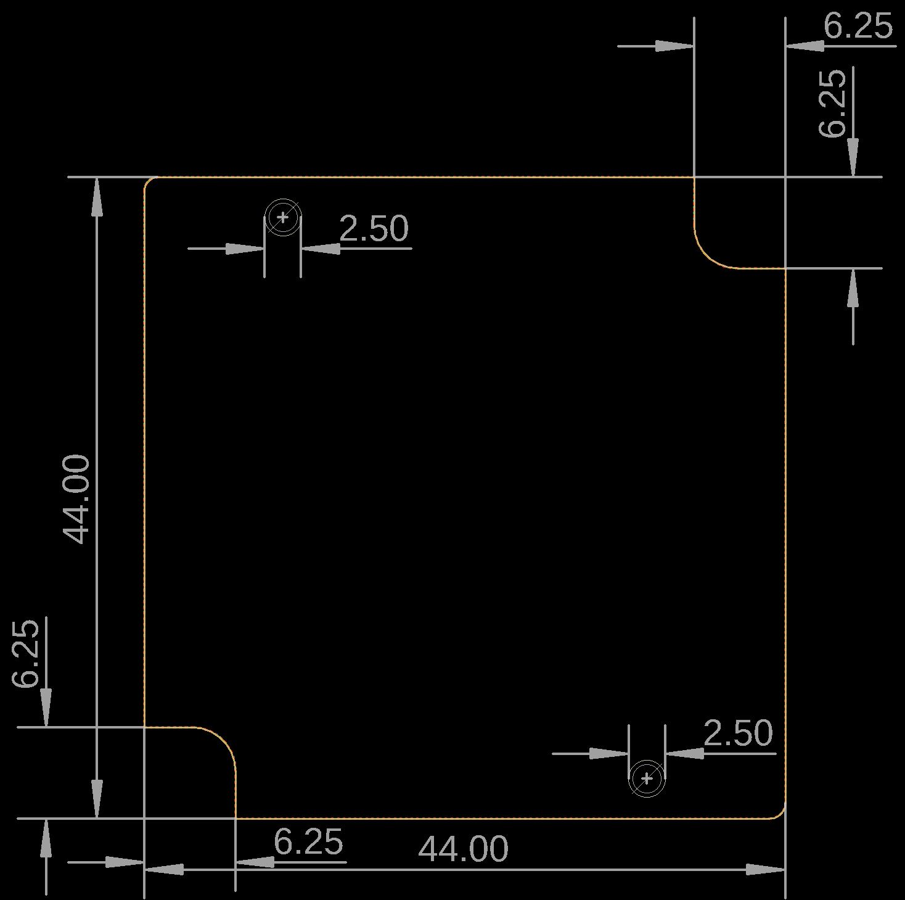

# hammond-project-boxes

EAGLE design blocks made for Hammond project boxes. I've used AutoCAD to export the proper .dfx files from the factory given 3D models than I imported them to Eagle with the import-dfx ULP. The outline of the box's inner part and the dimensions of the PCB can be seen on the document layer.

### How to use them
* Copy the design blocks (with .dbl extension) to the where they are stored by Eagle. It is usually the following on Windows: C:\Users\<username>\Documents\EAGLE\design blocks
* During the board layout process click on the "Add a Design Block" button then select the desired one. With one click place it where you want and delete the original board dimensions if it's required.

### Currently available PCB dimension design blocks
1551 Series: [https://www.hammfg.com/electronics/small-case/plastic/1551](https://www.hammfg.com/electronics/small-case/plastic/1551)
* **1151RFLBK, 1151RBK**
  * Height: 20 mm
  * Width: 50 mm
  * Length: 50 mm

